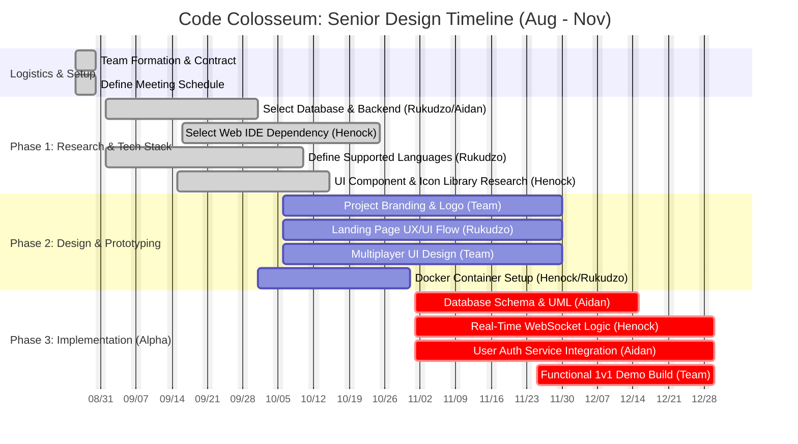

# SeniorDesign2025

## Team C&E
Advisor: Giovanni

Henock Dinberu, Aidan Sommer, Rukudzo Mushunje

Table of Contents:
1. Project Description
2. User Stories and Design Diagrams
3. Project Tasks and Timeline 
4. ABET Concerns Essay
5. PPT Slideshow 
6. Self-Assessment Essay
7. Professional Biographies 
8. Budget
- There have not been any expenses to date.
9. Appendix
- Source Code: https://github.com/nbybhen/CodeColosseum

|        Category        | Aidan Sommer | Rukudzo Mushunje | Henock Dinberu |
| :--------------------: | :----------: | :--------------: | :------------: |
|        Planning        |      6       |        6         |       6        |
|     Project Setup      |      2       |        2         |       2        |
|        Research        |      15      |        13        |       20       |
|        Ideation        |      10      |        10        |       10       |
|      UI Scetching      |      11      |        5         |       7        |
|      Development       |      4       |        4         |       8        |
| Platform Compatability |      3       |        8         |       7        |
| Architecture Sketching |      0       |        1         |       9        |
|                        |              |                  |                |
| Total Time Spent (hrs) |      51      |        49        |       69       |
